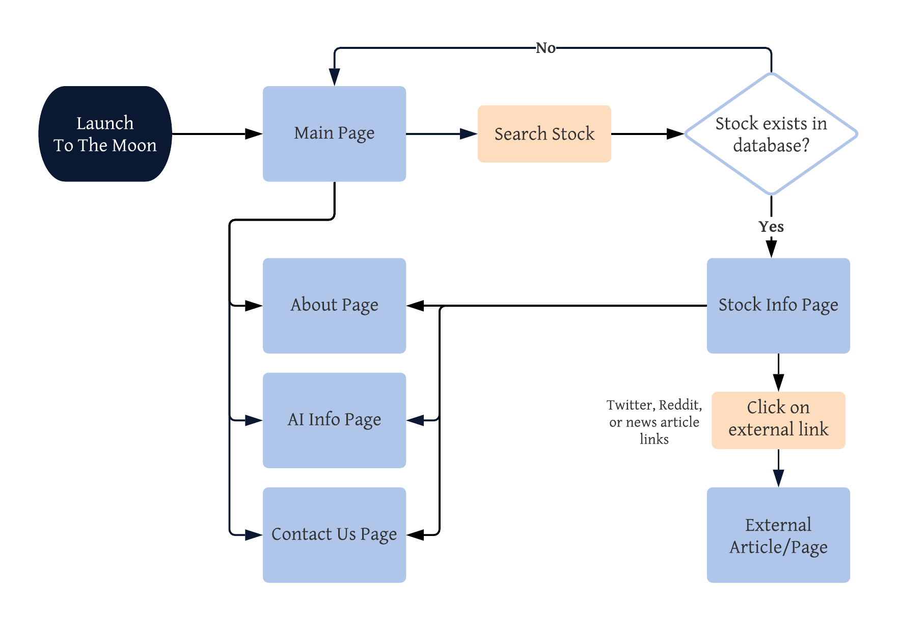

# To The Moon

#### Level of achievement: Apollo 11
#### An AI web application that analyses the stock market sentiment
To The Moon aims to use _natural language processing_ to process large amounts of social media posts on different stocks. By analysing these conversations over the internet, we provide users with the general sentiment surrounding the stocks that they wish to invest in.

## Motivation
Ever wished that you were part of the **1000%** rally of GameStop’s stock? Or the **800%** rally of Signal Advance’s? Due to a **Reddit** coordinated short squeeze, and a two word _tweet_ by Elon Musk respectively, prices of both stocks skyrocketed in a short period of time.

While such investments can be highly risky, these incidents have shown the impact social media can have on stock prices. We thus aim to collect such information, mainly in the form of text, from social media to find a correlation between such information and change in stock prices.

Using _artificial intelligence_, it is possible to classify this text data to understand the sentiments of other investors, and to use such analysis to predict short term price movements.

With the rise of young retail investors who increasingly exchange information on social media, we believe such analysis will become very valuable to understand the market.

## User Stories
>*"I am a retail investor and I have done my due diligence for a company I want to invest in. However the stock prices seem to be falling and I am not sure if I want to buy in now. I want to know if the stock prices will continue to fall."*

>*"I am a retail investor and the stock that I am holding is falling. I am not aware of any news related to it. I want to know what other investors are thinking about this stock."*

>*"I am an investor with a long investment horizon holding several stocks. I am not interested in short term price changes, and I do not spend much time on every single news about my stocks. I would want a quick summary to just know the sentiment of recent news articles on my stocks"*

## Aim
We plan to build a web application that makes stock price change predictions for most traded stocks on Nasdaq[1](#footnote1) by analysing social media posts. Our targeted users are beginner investors, as well as savvy investors who wish to capitalize on information from social media to augment their investment choices in as hassle-free a manner as possible.

## Core Features

### Frontend:
A web application that allows users to
+ Search for a stock and get the analysis for the sentiment of the stock based on **Twitter** and **Reddit** data
+ Get a prediction of whether chosen stock is likely to _rise_ or _fall_ in the short term
+ Get an overview of recent news of stocks and their general sentiment

### Backend:
+ Data collection scripts to save **Twitter _tweets_** and **Reddit _posts_** for training of AI
+ Machine learning model that can predict direction of price movement using recent social media data

### Possible Extensions:
+ View a list of stocks with the most bullish sentiment
+ Put stocks on watchlist to track daily changes in sentiment

### User flow diagram

## Development Timeline

### May
+ Design of static web user interface
+ Mining of **Twitter** and **Reddit** data for on various popular stock tickers
+ Research on common NLP techniques for **text classification** and **sentiment analysis**

### June
+ Performing **Exploratory Data Analysis** on collected data to visualise the collected data
+ _Training_ and _tuning_ of machine learning models using collected data
+ **Integration** of trained models with web application
+ _User_ and _system_ testing to discover bugs

### July
+ Further improvement on **accuracy** of machine learning models
+ Fixing of bugs based on collected feedback
+ **Extension** of frontend features of web application

## Tech Stack
1. Python-Flask framework
2. HTML/CSS/Javascript
3. Twitter, Reddit, Alpha Vantage APIs
4. Machine Learning libraries: Sklearn, Tensorflow
5. Natural Language libraries: NLTK, SpaCy

<a name="footnote1">1</a> The current list of tracked stocks are: AAL AAPL ABEV ABNB ABR ABT ACB ACST ADMP AEG AEO AES AGNC AHT AJG AMAT AMC AMCR AMD AMWL AMXVF APA APPS AR ARKK ARRY ATOS AUTL AUY AZN BA BABA BAC BB BBBY BBD BBVA BIDU BIL BILI BKR BMBL BMY BNGO BNTC BOX BP BRFS BSX C CAN CCIV CCL CLDR CLF CLNE CLNY CLOV CMCSA CNHI COG COIN COP CPE CPNG CRIS CRM CRWD CS CSCO CSPR CTRM CVE CVX CX DAL DBX DDD DIS DISCA DKNG DOCU DVN EBAY EBON EDU EEM ENB ERIC ET EWZ EXK EYES F FAMI FB FCEL FCX FEYE FHN FSLY FSM FSR FTEK FTI FUBO FUTU GE GEVO GFI GGB GILD GLW GM GME GNW GOLD GOTU GPS GSAT GSK HAE HAL HBAN HIMX HL HPE HPQ HRTX IBM IDEX IHT INFY ING INTC IPOE IQ ITUB IWM JBLU JD JMIA JNJ JPM KEY KGC KMI KO KOS KR LEDS LGHL LHDX LI LMND LPTH LTHM LU LUMN LUV LVS M MAC MARA MDRR MGM MO MOS MOSY MPC MPW MRK MRNA MRO MRVL MS MSFT MT MU MVIS NAKD NCLH NCTY NEE NEM NERV NIO NKE NKLA NLY NNDM NOK NOKPF NRZ NUAN NVDA OCGN ON OPEN OPGN ORCL OXY PAAS PALI PBR PBR-A PCG PD PEAK PFE PG PINS PLTR PLUG PSFE PSTG PSTH PTON PYPL QCOM QFIN QQQ QS RBLX RF RIDE RIG RIOT RKT RLX RMED RMO SAN SCHW SDC SENS SI SID SIRI SKLZ SLB SNAP SNDL SNOW SONO SOS SOXL SPCE SPY SQ SQQQ SRNE SRNG STAY STLA SU SWN SYF T TAL TECK TELL TEVA TFC TIGR TJX TLRY TME TNXP TPR TQQQ TRGP TSLA TSM TWTR UAA UAL UBER UEC UMC UPST UUUU UWMC VALE VEON VIAC VIPS VRM VST VTNR VTRS VZ WFC WISH WKHS WMB WPG WY X XLE XLF XOM XPEV ZM ZNGA ZOM